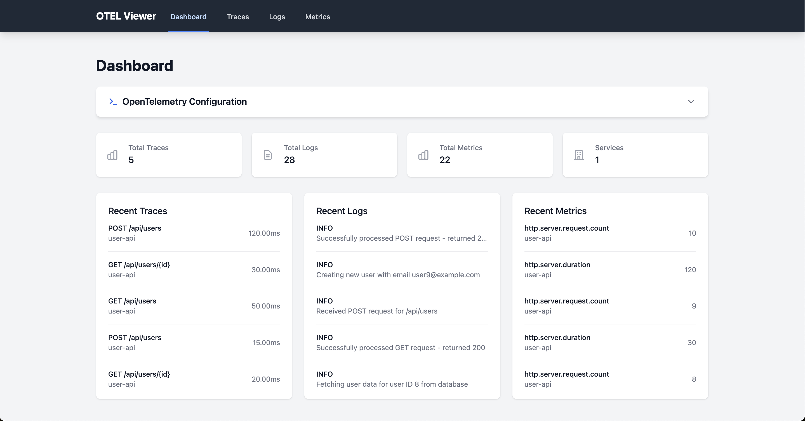
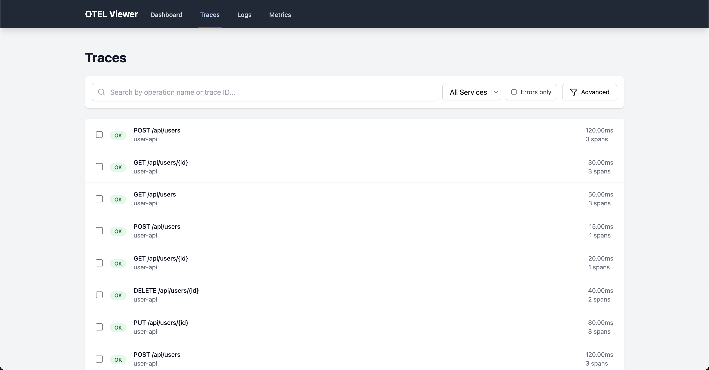
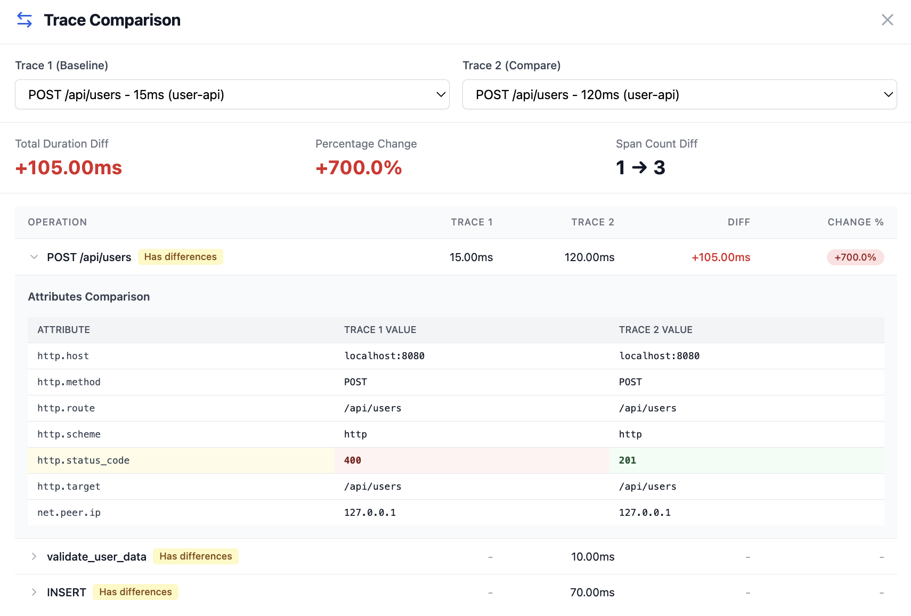
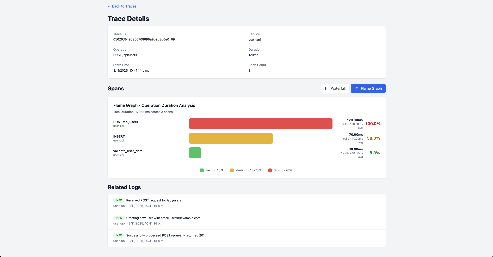
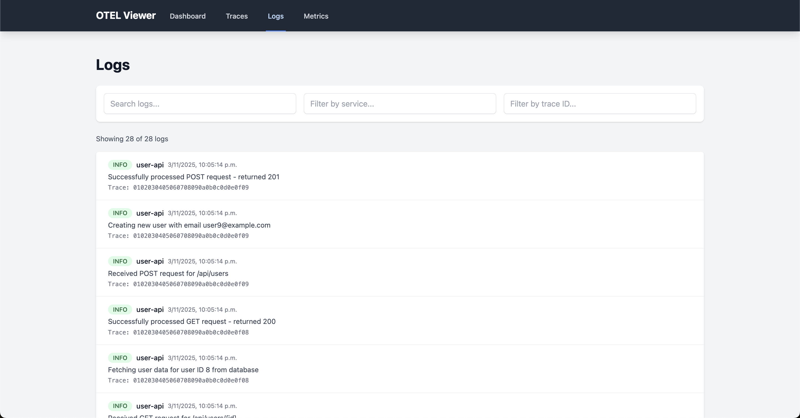
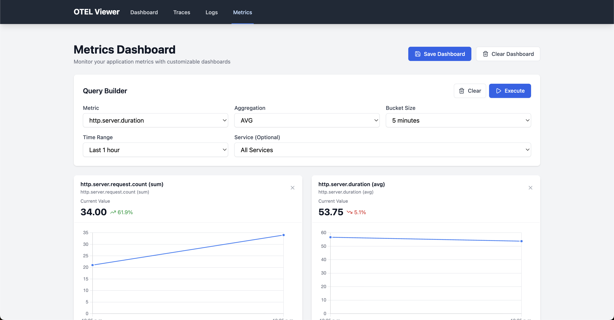

# OTEL Viewer - Local OpenTelemetry Trace & Log Viewer

A lightweight, single-binary OpenTelemetry viewer for local development. Visualize traces, logs, and metrics from your instrumented applications without Docker, Kubernetes, or complex setup. The easiest way to debug OpenTelemetry data locally.



## Why OTEL Viewer?

Most OpenTelemetry backends (Jaeger, Grafana, Zipkin) require Docker, databases, and complex configuration. **OTEL Viewer runs as a single binary with an in-memory database** - perfect for local development, testing OpenTelemetry instrumentation, and debugging distributed traces.

**Start viewing your telemetry data in under 30 seconds.**

Perfect for:
- 🚀 **Local development** - Test OTLP exporters without infrastructure
- 🐛 **Debugging** - Quickly visualize traces and correlated logs
- 📊 **Learning OpenTelemetry** - See how traces, logs, and metrics work together
- ⚡ **CI/CD pipelines** - Lightweight observability for ephemeral environments

## Features

### Distributed Tracing
- **Waterfall view** with timeline visualization
- **Flame graph** for performance analysis
- **Compare traces** side-by-side with attribute diffing
- Search by operation name or trace ID
- Filter by service, duration, and error status



### Trace Comparison
Compare two traces to spot differences in timing and attributes:



### Log Correlation
View logs linked to specific traces and spans:



### Logs Viewer
- Full-text search across all log messages
- Filter by severity, service, and time range
- Correlation with traces via trace_id



### Metrics Dashboard
- Custom dashboards with query builder
- Time series charts (line, area, bar)
- Aggregations: avg, sum, min, max, count
- Configurable time ranges and buckets
- Save dashboards to localStorage



### Other Features
- **In-memory database** (DuckDB) - no Docker required
- **OTLP receivers** for both HTTP (4318) and gRPC (4317)
- **Single binary** distribution with embedded frontend
- **Copy-paste config** helper for OTLP environment variables

## Installation

### Option 1: Homebrew (macOS & Linux)

The easiest way to install on macOS:

```bash
brew tap mesaglio/otel-front
brew install otel-front
```

To upgrade to the latest version:

```bash
brew upgrade otel-front
```

### Option 2: Download Pre-built Binary

Download the latest release for your platform:

**[📦 Download Latest Release](https://github.com/mesaglio/otel-front/releases/latest)**

Available for:
- **macOS** (Intel & Apple Silicon)
- **Linux** (x86_64 & ARM64)

Extract and run:

```bash
tar -xzf otel-front_*.tar.gz
./otel-front
```

### Option 3: Build from Source

```bash
git clone https://github.com/mesaglio/otel-front
cd otel-front
make release
./bin/otel-front
```

**Prerequisites for building:** Go 1.24+, Node.js 22+ (for building frontend)

---

## Quick Start

Start the viewer:
```bash
otel-front
```

The server starts on `http://localhost:8000` and **automatically opens your browser**.

Endpoints:
- Web UI: `http://localhost:8000`
- OTLP HTTP receiver: `http://localhost:4318`
- OTLP gRPC receiver: `localhost:4317`

### Send Test Data

Use the included script to generate realistic test data:

```bash
# Simulate CRUD operations (GET, POST, PUT, DELETE)
go run scripts/send_otlp_data.go --count 20
```

This simulates a User API with realistic traces, logs, and metrics.

## Configure Your Application

Point your instrumented application to OTEL Viewer:

### For HTTP (recommended)
```bash
export OTEL_EXPORTER_OTLP_ENDPOINT="http://localhost:4318"
export OTEL_LOGS_EXPORTER="otlp"
export OTEL_TRACES_EXPORTER="otlp"
export OTEL_METRICS_EXPORTER="otlp"
export OTEL_EXPORTER_OTLP_PROTOCOL="http/protobuf"
```

### For GRPC
```bash
export OTEL_EXPORTER_OTLP_ENDPOINT="http://localhost:4317"
export OTEL_LOGS_EXPORTER="otlp"
export OTEL_TRACES_EXPORTER="otlp"
export OTEL_METRICS_EXPORTER="otlp"
export OTEL_EXPORTER_OTLP_PROTOCOL="grpc"
```

The dashboard includes a **copy-paste helper** for these variables - just click the Copy button.

## Development

### Backend only
```bash
go run cmd/viewer/main.go --debug
```

### Frontend development
```bash
cd frontend
npm install
npm run dev
```

The frontend dev server proxies API requests to the backend.

### Build from source
```bash
# Build everything
make build

# Or step by step:
make frontend-build  # Build React app
make backend-build   # Build Go binary with embedded frontend
```

## API Endpoints

### Traces
- `GET /api/traces` - List traces (with filters)
- `GET /api/traces/:id` - Get trace details with all spans
- `POST /api/traces/compare` - Compare multiple traces

### Logs
- `GET /api/logs` - List logs (with filters and search)
- `GET /api/logs/trace/:traceId` - Get logs for a specific trace

### Metrics
- `GET /api/metrics` - List metrics
- `GET /api/metrics/names` - Get available metric names
- `POST /api/metrics/aggregate` - Aggregate metrics over time

### Services
- `GET /api/services` - List all unique services

### Health
- `GET /health` - Health check

## Command Line Options

```bash
otel-front --help

Options:
  --version           Show version information
  --port              HTTP server port (default: 8000)
  --otlp-http-port    OTLP HTTP receiver port (default: 4318)
  --otlp-grpc-port    OTLP gRPC receiver port (default: 4317)
  --debug             Enable debug logging
  --no-browser        Don't open browser automatically
```

## Testing

```bash
# Send test OTLP data
go run scripts/send_otlp_data.go --count 20

# Or continuously (for live dashboard testing)
while true; do 
  go run scripts/send_otlp_data.go --count 10
  sleep 5
done
```

## Contributing

Contributions welcome! This tool is built for developers, by developers.

1. Fork the repository
2. Create a feature branch (`git checkout -b feature/amazing-feature`)
3. Make your changes
4. Run tests (`make test`)
5. Commit (`git commit -m 'feat: add amazing feature'`)
6. Push (`git push origin feature/amazing-feature`)
7. Open a Pull Request

## Frequently Asked Questions

### How do I view OpenTelemetry traces locally?
Just download OTEL Viewer, run it, and point your application's OTLP exporter to `http://localhost:4318`. No Docker, no configuration files needed.

### What's the easiest way to debug OpenTelemetry locally?
OTEL Viewer is designed specifically for this - it's a single binary that starts in seconds and provides a full-featured UI for traces, logs, and metrics.

### Can I use this instead of Jaeger for local development?
Yes! OTEL Viewer accepts standard OTLP data (HTTP and gRPC) and provides trace visualization, search, and comparison features without requiring Docker or external databases.

### How to test OpenTelemetry instrumentation locally?
Install OTEL Viewer, run it with `otel-viewer`, and configure your application's OTLP endpoint to `http://localhost:4318`. The UI shows traces, logs, and metrics in real-time.

### Do I need Docker to view OpenTelemetry data?
Not with OTEL Viewer! Unlike Jaeger, Zipkin, or Grafana setups, OTEL Viewer runs as a standalone binary with an in-memory database.

## Keywords

OpenTelemetry viewer, OTLP viewer, local telemetry, trace viewer, OpenTelemetry local development, OTEL debugging, distributed tracing local, OpenTelemetry without Docker, lightweight telemetry viewer, OTLP receiver, OpenTelemetry dashboard, trace visualization, observability local development

## License

MIT

## Acknowledgments

Inspired by [otel-desktop-viewer](https://github.com/CtrlSpice/otel-desktop-viewer).

---

**Built for local OpenTelemetry debugging - because not everything needs Kubernetes.**
